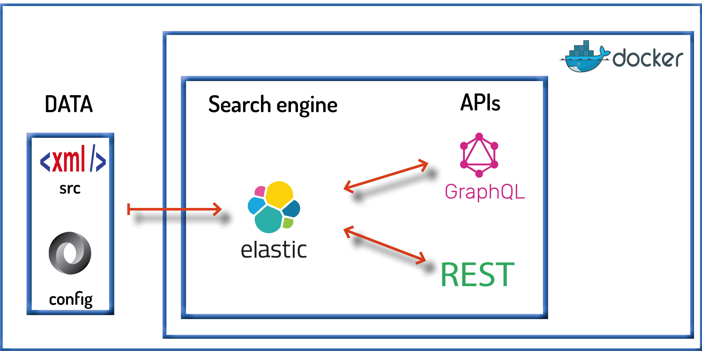

# Kosh - APIs for Dictionaries
{: .fs-9 }

Kosh is an open-source framework developed for creating and maintaining APIs for dictionaries
{: .fs-6 .fw-350}

[View it on GitHub](https://github.com/cceh/kosh){: .btn .btn-primary .fs-5 .mb-4 .mb-md-0 .mr-2 }

Kosh has been conceived to provide API access to any XML-encoded lexical dataset. 
Its name Kosh derives from the Hindi word for dictionary or lexicon, कोश _koś_ or _kosh_, which in turn derives from Sanskrit कोश 
_kośa_ with the same meaning. 
Kosh’s origin is related to API development for [TEI-encoded Sanskrit dictionaries](https://cceh.github.io/c-salt_sanskrit_data/) at the University of Cologne, where the most important 
digital collection of Sanskrit dictionaries worldwide, the [Cologne Digital Sanskrit Dictionaries](https://www.sanskrit-lexicon.uni-koeln.de/) is hosted.

## Features

* Kosh processes lexical data in XML format.
* Two APIs, GraphQL and REST, access the data stored in elasticsearch.
* Kosh can be deployed either via Docker or natively on Unix-like systems.

## How to run Kosh

You can configurate Kosh to create APIs for any XML-encoded lexical resource. Learn how to do it for your own resources in [deployment](/docs/deployment.md)

## References

Mondaca, Francisco, Philip Schildkamp, and Felix Rau. 2019. 
“Introducing Kosh, a Framework for Creating and Maintaining APIs for Lexical Data.” 
_In Electronic Lexicography in the 21st Century. Proceedings of the eLex 2019 Conference_, Sintra, Portugal. 
Brno: Lexical Computing CZ, s.r.o., 907–21. [(PDF)](https://elex.link/elex2019/wp-content/uploads/2019/09/eLex_2019_51.pdf)

## Contact 
If you have any questions, contact the Kosh team: info-kosh[a]uni-koeln.de
